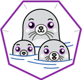

# Podman


[Podman GitHub Pages](https://github.com/containers/podman/)

[official website](https://podman.io/)

- מנוע להרצת קונטיינרים המפותח ע"י רד האט
- מריץ קונטיינרים ללא הצורך בשירות (daemon/service), מה שיוצר סביבה יותר מאובטחת
- יכול לרוץ עם הרשאות משתמש רגיל (rootless) או עם הרשאות מנהל (root)
- יכול להריץ פודים מה שמקל על המעבר לקוברנטיס
- ניתן לבנות alias לפקודה docker שתריץ podman, וכך להמשיך להשתמש בפקודות docker רגילות


### Get started

```sh
# make sure podman is installed
podman --version
```

```sh
# podman run my demo container
podman run --name mycontainer -d -p 8081:8080 natalicot/my_awsome_app:1.0.1
```

```sh
# podman run my demo container
podman run --name mycontainer -d -p 8081:8080 natalicot/my_awsome_app:1.0.1
```

```sh
# show the running container
podman ps
```

```sh
# you can now access your container on:
echo loclhost:8081
```

```sh
# generate a pod YAML
podman generate kube mycontainer > mycontainer.yml
```

### Alias
```sh
# you alias podman to docker and work as usual
alias docker=podman
```

```sh
# test the alias
docker ps
```
