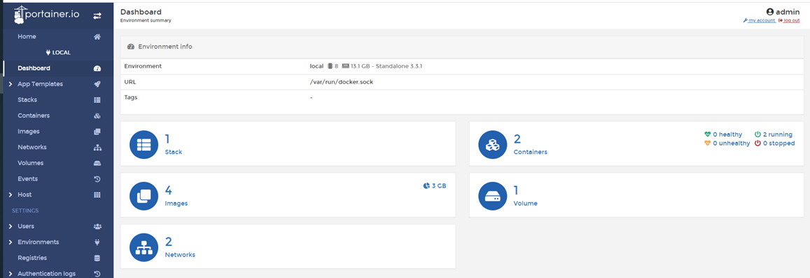

# Portainer


[Portainer GitHub Pages](https://github.com/portainer/portainer)

[official website](https://www.portainer.io/)

### About
- פורטיינר הוא כלי הנכטב בקוד פתוח המשמש כממשק משתמש לקונטיינרים
- פורטיינר רץ כקונטייר ומתחבר לסוקט
- כדי להריץ פורטיינר עם פודמן צריך להריץ את פודמן עם סיסטם די





## Get started

### Portainer and docker

```sh
# create the portainer volume
docker volume create portainer_data
```

```sh
# download and install the Portainer Server container
docker run -d -p 8000:8000 -p 9443:9443 --name portainer \
    --restart=always \
    -v /var/run/docker.sock:/var/run/docker.sock \
    -v portainer_data:/data \
    cr.portainer.io/portainer/portainer-ce:2.9.3
```

```sh
# make sure the container is running
docker ps
```

```sh
# you can now access the app on:
echo https://localhost:9443
```

### Portainer and Podman

כדי להתמש בפורטיינר עם פודמן צריך לאפשר גישה לסוקט של הפודמן, כדי לעשות את זה יש להפעיל את מערכת הלינוקס עם סיסטם די. מדריך:

[Enable systemd in WSL 2](https://gist.github.com/djfdyuruiry/6720faa3f9fc59bfdf6284ee1f41f950)

##### Enable systemd in WSL 2:

- Copy the contents of `install-sg.sh` to a new file `/tmp/install-sg.sh`:

  ```bash
  cd /tmp
  wget --content-disposition \
    "https://gist.githubusercontent.com/djfdyuruiry/6720faa3f9fc59bfdf6284ee1f41f950/raw/952347f805045ba0e6ef7868b18f4a9a8dd2e47a/install-sg.sh"
  ```

- Make it executable:

  ```bash
  chmod +x /tmp/install-sg.sh
  ```

- Run the new script:

  ```bash
  /tmp/install-sg.sh && rm /tmp/install-sg.sh
  ```

- Exit the WSL terminal and shutdown the WSL env:

  ```bash
  wsl --shutdown
  ```

- To open a new WSL terminal with `systemd` enabled, run:

  ```powershell
  wsl genie -s
  ```

- Prove that it works:

  ```bash
  sudo systemctl status time-sync.target
  ```

#### Running Portainer with podman
```sh
# create the portainer volume
sudo podman volume create portainer_data
```

```sh
# download and install the Portainer Server container
sudo podman run -d -p 8000:8000 -p 9443:9443 --name portainer \
    --restart=always \
    -v /run/podman/podman.sock:/var/run/docker.sock \
    -v portainer_data:/data \
    cr.portainer.io/portainer/portainer-ce:2.9.3
```

```sh
# make sure the container is running
podman ps
```

```sh
# you can now access the app on:
echo https://localhost:9443
```
