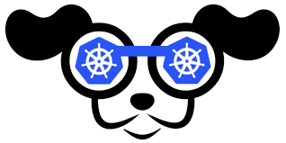

# k9s


[k9s GitHub Pages](https://github.com/derailed/k9s)

[official website](https://k9scli.io/)

### About

- K9s provides a terminal UI to interact with your Kubernetes clusters.

- make it easier to navigate, observe and manage your applications.

- K9s continually watches Kubernetes for changes and offers subsequent commands to interact with your observed resources.


### Get started
```sh
# make sure k9s is installed
k9s version
```

```sh
# get into your k9s terminal
k9s
```

```sh
# press on your keyboard:
:
```

```sh
# type in pods and hit enter
:pods ↩
# now you see all your running pods
```
